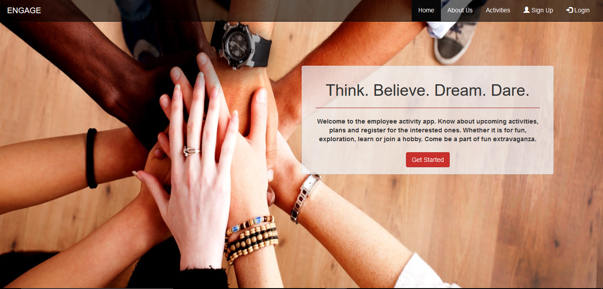

# ENGAGE Website

This is a demo project for activity sign-up for employee engagement. This website has been developed in Angular 4 using Bootstrap and PrimeNG Components supported by .NET CORE Web APIs using in-memory Entity Framework.

## Running Engage locally

Steps to run the application locally are as below:

1. Clone the repository.

```
	git clone https://github.com/ayushmunjal/Demo-Projects.git
```

2. Run Web APIs
```
	cd TestAPI
	dotnet restore
	dotnet run
```
You can check API here: `http://localhost:5000/api/values/activities`.

3. Run Website. Please use a new window of command prompt.
```
	cd Engage
	npm install
	npm start
```

You can then access ENGAGE here: `http://localhost:4200/`. 



## Working with ENGAGE

### prerequisites

The following items should be installed in your system:
* Node.js 
* git command line tool 
* dotnet command line tool (.Net Core 2.x)

