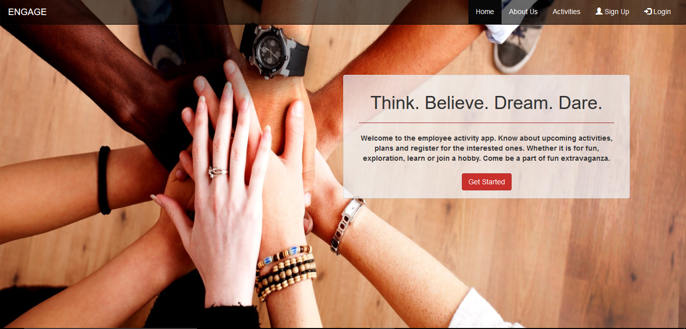

# ENGAGE Website

This is a demo project for activity sign-up for employee engagement. This website has been developed in Angular 4 using Bootstrap and PrimeNG Components. 

## Running Engage locally

```
	git clone https://github.com/ayushmunjal/Demo-Projects.git
	cd Engage
	npm install
	npm start
```

You can then access ENGAGE here: `http://localhost:4200/`. 



## Working with ENGAGE

### prerequisites

The following items should be installed in your system:
* Node.js 
* git command line tool 

